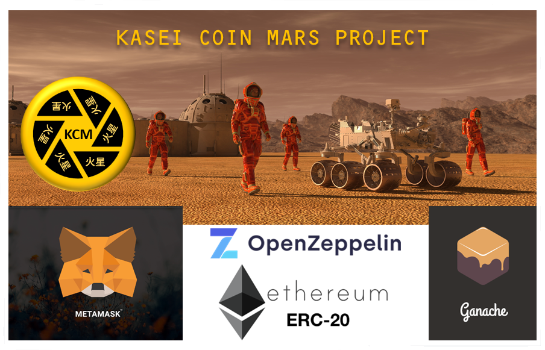

# Module_21_Martian_Token_Crowdsale
Ethereum blockchain and virtual machine smart contracts built using the ERC-20 standard and OpenZepplin libraries to mint a fungible token ('KaseiCoin') and facilitate its crowdsale.

Author: Bruno Ivasic   
Date: 30 January 2024

# Briefing Summary
After waiting for years and passing several tests, you were selected by the Martian Aerospace Agency (a fictitious organization) to become part of the first human colony on Mars. As a prominent fintech professional, you were chosen to lead a project developing a monetary system for the new colony. You decide to base this new system on blockchain technology and to define a new cryptocurrency, named KaseiCoin. (Kasei means Mars in Japanese.)   
KaseiCoin will be a fungible token that’s ERC-20 compliant. You’ll launch a crowdsale that will allow people who are moving to Mars to convert their earthling money to KaseiCoin.

# Submission  
Source files associated with this solution:   
* [KaseiCoin Token smart contract source code: /Submission/Code/KaseiCoin.sol](./Submission/Code/KaseiCoin.sol)
* [KaseiCoinCrowdsale smart contract source code: /Submission/Code/KaseiCoinCrowdsale.sol](./Submission/Code/KaseiCoinCrowdsale.sol)   

## Evaluation Evidence
### Successful compilation of the KaseiCoin contract (Step 1.8)
   

---
### Successful compilation of the KaseiCoinCrowdsale contract (Step 2.4)
   

---

### Successful compilation of the KaseiCoinCrowdsaleDeployer contract (Step 3.5)
   

---

### Deploy and Test the Crowdsale on a Local Blockchain (Step 4)
#### Video recording
View the [video recording](https://drive.google.com/file/d/1gqw-1IYPgiyvVy9d0pZIXzlm-k8vcMow/view?usp=drive_link) which demonstrates connecting Ganache, MetaMask and Remix, and deploying and interacting with the smart contracts in the project.   

##### Video segments by time
* Connecting Ganache to MetaMask and importing Ganache Accounts into MetaMask 00:00 - 02:57
* Deploying the KaseiCoinCrowdsaleDeployer contract to the local blockchain using Remix, MetaMask, and Ganache 02:57 - 04:19
* Testing the functionality of the crowdsale contract using test accounts to buy new tokens and then checking the balances of those accounts
  * Testing the KaseiCoinCrowdsale contract 04:19 - 06:23
  * Testing the KaseiCoin contract 06:23 - 07:39

### Ganache transaction logs
   

---
# Scope for Future Enhancements
Future version may include:
* CappedCrowdsale: To cap the total amount of ether that the crowdsale can raise.
* TimedCrowdsale: To set a time limit for the crowdsale by adding an opening time and a closing time.
* RefundablePostDeliveryCrowdsale: To include the capability of refunding investors of the crowdsale if the funding goal isn't met.

# Technologies
* [Solidity](https://soliditylang.org/) - A statically-typed curly-braces programming language designed for developing smart contracts that run on Ethereum
* [OpenZepplin ERC-20 Contracts](https://github.com/OpenZeppelin/openzeppelin-contracts/tree/release-v2.5.0/contracts/token/ERC20) - A set of interfaces, contracts, and utilities related to the [ERC20 Token Standard](https://eips.ethereum.org/EIPS/eip-20)
* [Remix - Ethereum IDE](https://remix-ide.readthedocs.io/en/latest/) - an Integrated Development Environment (IDE) for smart contract development 
* [Ethereum Virtual Machine (EVM)](https://docs.soliditylang.org/en/v0.8.23/introduction-to-smart-contracts.html#the-ethereum-virtual-machine) - the runtime environment for smart contracts in Ethereum
* [Truffle Suite Ganache](https://trufflesuite.com/docs/ganache/) - a personal blockchain for rapid Ethereum and Filecoin distributed application development
* [MetaMask](https://metamask.io/) - a software cryptocurrency wallet used to interact with the Ethereum blockchain

# Concepts
* ERC-20 Fungible Token Smart Contract
* Crowdsale
* Automated Smart Contract Deployment
* Ethereum Blockchain Transactions
* Smart Contract
* Ethereum Virtual Machine (EVM)
* Crypto Wallets
* Connecting Ganache to MetaMask
* Connecting MetaMask to Remix

# Enhancements to base starter code
* Items marked as @TODO
* Documentation and Commenting
  * Adopted [Ethereum Natural Language Specification Format \(NatSpec\)](https://docs.soliditylang.org/en/develop/natspec-format.html) for code commenting. 
  * Added in-depth comments in complex sections of the code to enhance the maintainability and scalability of the application code. 

# Dependencies
* [OpenZeppelin ERC20](https://github.com/OpenZeppelin/openzeppelin-contracts/blob/release-v2.5.0/contracts/token/ERC20/ERC20.sol)
* [OpenZeppelin ERC20Detailed](https://github.com/OpenZeppelin/openzeppelin-contracts/blob/release-v2.5.0/contracts/token/ERC20/ERC20Detailed.sol)
* [OpenZeppelin ERC20Mintable](https://github.com/OpenZeppelin/openzeppelin-contracts/blob/release-v2.5.0/contracts/token/ERC20/ERC20Mintable.sol)
* [OpenZeppelin Crowdsale](https://github.com/OpenZeppelin/openzeppelin-contracts/blob/release-v2.5.0/contracts/crowdsale/Crowdsale.sol)
* [OpenZeppelin MintedCrowdsale](https://github.com/OpenZeppelin/openzeppelin-contracts/blob/release-v2.5.0/contracts/crowdsale/emission/MintedCrowdsale.sol)

# Installation / Setup
* Install [Ganache](https://trufflesuite.com/docs/ganache/quickstart/)
* Install [MetaMask](https://metamask.io/download/)
* Launch [Remix Online IDE](https://remix.ethereum.org) 

# Launching
In a supported browser visit the [Remix Online IDE https://remix.ethereum.org](https://remix.ethereum.org), and then:
1. Import both the KaseiCoin.sol and KaseiCoinCrowdsale.sol files into Remix   
1. In the Compiler pane set the Compiler version to 0.5.5+ and the EVM version to `constantinople`   
1. Compile both modules
1. [View the video](https://drive.google.com/file/d/1gqw-1IYPgiyvVy9d0pZIXzlm-k8vcMow/view?usp=drive_link) for further instructions (as presented earlier)

# Briefing
* [Assignment Briefing](./Briefing/README.md)   

# Disclaimer
1. The smart contract included in this project is provided as is.
1. No guarantee, representation or warranty is being made, express or implied, as to the safety or correctness of the user interface or of the smart contract itself.
1. This smart contract has not been independently audited and as such there is no assurance that it will work as intended. Users may experience delays, failures, errors, omissions, loss of transmitted information, or financial loss.
1. No warranty of merchantability, non-infringement or fitness for any particular purpose is made.
1. Use of this smart contract may be restricted or prohibited under applicable law, including securities laws.
1. Advice from competent legal counsel is strongly recommended before considering use of this smart contract.
1. Information provided in this repository shall not be construed as investment advice or legal advice, and is not meant to replace competent legal counsel.
